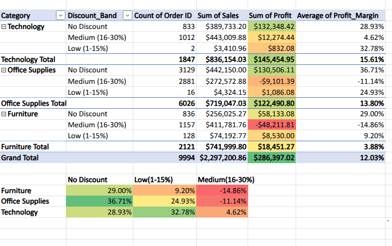

# ConnectRetail Profitability Analysis

**Business intelligence dashboard built entirely in Excel Web**


## Project Overview

Comprehensive profitability analysis of a US-based office supplies and furniture retailer, identifying root causes of margin decline and quantifying improvement opportunities.

**Key Achievement:** Identified $407K in annual profit improvement opportunities (142% increase from baseline)

##  Business Problem

ConnectRetail faced a critical profitability issue:
- Revenue grew 12% YoY
- Profit grew only 3% YoY (75% slower growth)
- Returns increased 18%
- Unknown sources of margin leakage

**Question:** Why is profit growing slower than revenue, and where are we losing margin?

##  Scope of Analysis

**Dataset:**
- Source: Kaggle Superstore Sales Dataset
- Size: 9,994 transactions
- Period: 2014-2017 (4 years)
- Dimensions: Products, Customers, Geography, Time

**Analyses Conducted:**
1. **Profitability Analysis** - Category and product-level margin assessment
2. **Discount Impact Analysis** - Pricing strategy effectiveness evaluation
3. **Customer Segmentation** - Value tier classification and lifetime value projection

## Key Findings

### Finding #1: Category Profitability Crisis
- **Furniture:** 32% of revenue but only 3.9% margin
- **Tables Sub-Category:** -$17,725 profit (actively destroying value)
- **Technology:** Healthy 15.6% margins (model for improvement)

**Impact:** $125K opportunity in product portfolio optimization

### Finding #2: Discount Death Zone
- **Medium discounts (16-30%):** Created -$57K in annual losses
- **High discounts (31%+):** -$76.39 loss per order on 581 orders
- **Furniture + Medium discount:** -14.86% margin (destroyed $48K)

**Impact:** $276K recovery opportunity through discount policy reform

### Finding #3: Customer Concentration Risk
- **Top 10% (80 VIP customers):** Generate ~50% of total profit
- **Bottom 10% (179 unprofitable):** Cost -$6K annually
- **3-Year Value at Risk:** $500K+ if top segments churn

**Impact:** $200K-400K value protection through retention programs

## Total Opportunity Identified

| Initiative | Annual Impact | Timeline |
|------------|---------------|----------|
| Discount Policy Reform | +$276K | Immediate |
| Product Portfolio Optimization | +$125K | 30 days |
| Unprofitable Customer Cleanup | +$6K | 60 days |
| **TOTAL PROFIT IMPROVEMENT** | **+$407K** | **90 days** |

**Result:** Profit increases from $286K to $693K (142% improvement)

## Tools & Constraints

**Primary Tool:** Microsoft Excel Web (Office 365 browser-based)

**Key Constraint:** No access to Excel Desktop due to Linux OS
- No Power Query
- No VBA/Macros
- No advanced data modeling features
- Dataset size limitations (optimal: 5K-15K rows)

**Creative Workarounds:**
- Manual data transformation using formulas instead of Power Query
- Helper columns instead of pivot calculated fields
- Conditional formatting as visualization alternative
- Strategic data sampling to manage size constraints

##  Technical Approach

**Excel Features Utilized:**
- Pivot Tables (10+ analyses)
- Advanced Formulas (SUMIF, AVERAGEIF, PERCENTILE, nested IFs)
- Conditional Formatting (color scales, data bars, icon sets)
- Interactive Slicers (category and segment filtering)
- Data Visualization (8 charts, 3 heatmaps)
- Structured Tables (enabling dynamic formulas)

**Key Formulas:**
```excel
# Customer Segmentation
=IF(Profit<0,"Unprofitable",IF(Profit>=PERCENTILE($Profit,0.9),"VIP",...))

# Discount Band Classification
=IF(Discount=0,"No Discount",IF(Discount<=0.15,"Low",...))

# Customer Lifetime Value
=AVERAGEIF(Segment,"VIP",Orders)*AVERAGEIF(Segment,"VIP",Profit_per_Order)*3
```

## Repository Structure
```
connectretail-excel-analysis/
├── README.md (this file)
├── DOCUMENTATION.md (detailed methodology)
├── METHODOLOGY.md (technical approach)
├── EXECUTIVE_SUMMARY.pdf (1-page overview)
├── screenshots/
│   ├── dashboard.png
│   ├── profitability-analysis.png
│   ├── discount-heatmap.png
│   └── customer-segments.png
├── data/
│   └── superstore-sample.csv (anonymized)
└── deliverables/
    └── ConnectRetail_Dashboard.xlsx
```

## Key Recommendations

**Immediate Actions (Week 1-2):**
1. Implement category-specific discount caps (Furniture: 5%, Office: 10%, Tech: 20%)
2. Phase out Tables sub-category or increase pricing 40%

**Short-Term (Month 1-3):**
3. Launch VIP retention program (dedicated account managers for top 79 customers)
4. Implement minimum order value for unprofitable customer segment

**Long-Term (Quarter 2+):**
5. Shift marketing investment to high-margin categories (Technology, Office Supplies)
6. Revise sales compensation to incentivize profit over revenue

## Dashboard Features

**Interactive Elements:**
- 5 KPI scorecards (Revenue, Profit, Margin, VIP Count, Risk)
- Category and Segment slicers for dynamic filtering
- Real-time chart updates based on selections

**Visual Components:**
- Profitability breakdown by category
- Discount impact heatmap (Category × Discount Band)
- Customer segmentation distribution
- 90-day action plan with quantified impacts

## Skills Demonstrated

**Technical:**
- Advanced Excel (Pivot Tables, Complex Formulas, Dashboard Design)
- Data Analysis (Margin Analysis, Customer Segmentation, Statistical Analysis)
- Data Visualization (Chart Design, Conditional Formatting, Interactive Dashboards)
- Problem-Solving (Creative workarounds for tool limitations)

**Business:**
- Financial Analysis (Profit margin assessment, ROI calculation)
- Customer Analytics (RFM segmentation, CLV projection)
- Strategic Thinking (Prioritized recommendations by impact)
- Communication (Executive-ready insights and presentations)

## Visual Samples

### Dashboard Overview


### Discount Impact Heatmap


### Customer Segmentation


## Project Timeline

**Duration:** 14 days (approximately 40 hours)

**Phase Breakdown:**
- Data Preparation: 6 hours (15%)
- Analysis: 10 hours (25%)
- Dashboard Creation: 8 hours (20%)
- Documentation: 4 hours (10%)
- Excel Web Troubleshooting: 6 hours (15%)
- Quality Assurance: 4 hours (10%)
- Learning/Iteration: 2 hours (5%)

## Additional Resources


## Key Lessons Learned

**Excel Web Capabilities:**
- ✅ Handles 5K-15K rows efficiently
- ✅ Pivot tables work well
- ✅ Basic slicers functional
- Struggles with 20K+ rows
- Limited chart customization
- No Power Query reliability

**Main Takeaway:** Tool limitations don't prevent quality analysis—they require creative problem-solving and adaptability.

## Contact

**Sharon Odiwa**
- LinkedIn: https://www.linkedin.com/in/sharonodiwa/
- Email: odiwasharon@gmail.com
- Portfolio: 
- GitHub: https://github.com/Justsharon

## License

This project is available for educational and portfolio purposes. Dataset sourced from Kaggle (public domain).

---

**If this project helped you, please star this repository!**
